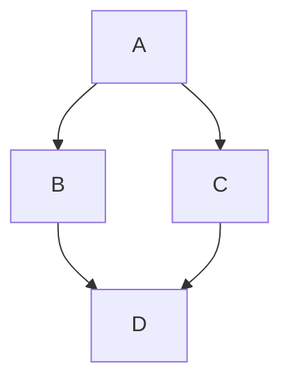

# Architecture cible de la pipeline

## Diagramme Mermaid

```mermaid
flowchart LR
  %% Sources
  subgraph SRC[Sources externes]
    S1["email_source - format: .mbox"]
    S2["web_source - format: JSON HTTP"]
    S3["chat_source - format: JSONL websocket"]
  end

  %% Ingestion
  subgraph ING[Ingestion]
    L1[email_loader]
    L2[web_loader]
    L3[chat_loader]
    MRG["merge_raw - format: List of RawDemande"]
  end

  %% Validation + nettoyage
  subgraph PREP[Preparation]
    V1["validation_pydantic - RawDemandeSchema"]
    C1["cleaning - normalize + anti-homoglyphes"]
  end

  %% Enrichissement
  subgraph ENR[Enrichissement]
    H1["hash_body - SHA-256(body)"]
    CACHE["enrichment_cache - PostgreSQL table cache"]
    CH{cache hit ?}

    LMODEL["enrich_language - lang, confidence"]
    LOK{modele langue dispo ?}
    LFALL["fallback_language - lang=unknown, confidence=0.0"]

    SMODEL["enrich_sentiment - label, score"]
    SOK{modele sentiment dispo ?}
    SFALL["fallback_sentiment - label=neutral, score=0.0"]

    EOUT["EnrichedDemande - RawDemande + lang + sentiment"]
  end

  %% Stockage + routage
  subgraph CORE[Core metier]
    DB["PostgreSQL - raw_demande + enriched_demande"]
    ROUTE["routage_prioritaire - priority_score + queue"]
  end

  %% API
  subgraph API[API]
    IN["POST /predict - Entree: PredictRequest JSON"]
    OUT["200 PredictResponse - Sortie: prediction enrichie JSON"]
  end

  %% Flux sources -> loaders
  S1 -->|.mbox| L1
  S2 -->|application/json| L2
  S3 -->|jsonl / ws message| L3

  %% Flux loaders -> merge -> validation -> cleaning
  L1 -->|List RawDemande| MRG
  L2 -->|List RawDemande| MRG
  L3 -->|List RawDemande| MRG
  MRG -->|RawDemande| V1
  V1 -->|RawDemande valide| C1

  %% API entry
  IN -->|PredictRequest JSON| V1

  %% Cache and enrich
  C1 -->|RawDemande.body| H1
  H1 -->|hash_body| CH
  CH -->|oui: EnrichmentResult| CACHE
  CH -->|non| LOK

  LOK -->|oui| LMODEL
  LOK -->|non| LFALL
  LMODEL -->|lang, confidence| SOK
  LFALL -->|lang=unknown| SOK

  SOK -->|oui| SMODEL
  SOK -->|non| SFALL

  SMODEL -->|sentiment, score| EOUT
  SFALL -->|neutral, 0.0| EOUT

  %% write-through cache
  EOUT -->|hash_body -> EnrichmentResult| CACHE

  %% persist + route + API output
  EOUT -->|INSERT EnrichedDemande| DB
  C1 -->|INSERT RawDemande| DB
  EOUT -->|EnrichedDemande| ROUTE
  ROUTE -->|priority_ticket JSON| OUT

  %% Existing vs new styling
  classDef existing fill:#d1d5db,stroke:#6b7280,color:#111827,stroke-width:1px;
  classDef new fill:#dbeafe,stroke:#2563eb,color:#0f172a,stroke-width:1.5px;
  classDef decision fill:#fde68a,stroke:#b45309,color:#111827,stroke-width:1.5px;
  classDef store fill:#dcfce7,stroke:#15803d,color:#052e16,stroke-width:1.5px;

  %% Hypothese M3: email_loader + cleaning + PostgreSQL de base deja presents
  class L1,C1,DB existing;

  %% Nouveaux composants M4
  class S1,S2,S3,L2,L3,MRG,V1,H1,CACHE,LMODEL,LFALL,SMODEL,SFALL,EOUT,ROUTE,IN,OUT new;
  class CH,LOK,SOK decision;
  class CACHE,DB store;
```

## Tableau des composants

| Composant | Statut | Responsabilite | Entree | Sortie |
|---|---|---|---|---|
| email_loader | existant (M3) | Ingestion mbox | fichier .mbox | List[RawDemande] |
| web_loader | a implementer | Ingestion web (HTTP/JSON) | payload application/json | List[RawDemande] |
| chat_loader | a implementer | Ingestion chat (temps reel / JSONL) | message ws ou .jsonl | List[RawDemande] |
| merge_raw | a implementer | Unifier les flux multi-sources | List[RawDemande] (xN) | RawDemande |
| validation_pydantic | a implementer | Valider le schema et les champs obligatoires | RawDemande | RawDemande valide |
| cleaning | existant (M3) | Normalisation texte, sanitation, anti-homoglyphes | RawDemande.body | cleaned_body |
| hash_body | a implementer | Generer cle de cache deterministe | cleaned_body | hash_body (SHA-256) |
| enrichment_cache | a implementer | Memoriser un enrichissement deja calcule | hash_body | EnrichmentResult (cache hit) |
| enrich_language | a implementer | Detection langue | RawDemande.body | lang, confidence |
| fallback_language | a implementer | Valeur de secours si modele indisponible | signal indisponibilite modele | lang=unknown, confidence=0.0 |
| enrich_sentiment | a implementer | Classification sentiment | RawDemande.body + lang | label, score |
| fallback_sentiment | a implementer | Valeur de secours si modele indisponible | signal indisponibilite modele | label=neutral, score=0.0 |
| postgres_store | existant (M3) | Persister brut + enrichi | RawDemande / EnrichedDemande | lignes SQL committees |
| routage_prioritaire | a implementer | Calcul priorite et routage file | EnrichedDemande | priority_ticket |
| API POST /predict | a implementer | Point d'entree prediction enrichie | PredictRequest JSON | PredictResponse JSON |
| API response | a implementer | Point de sortie avec resultat complet | priority_ticket + enrichissements | JSON (lang, sentiment, priorite) |

## Notes d'implementation

- Le cache est en mode write-through: chaque enrichissement calcule est immediatement persiste.
- Le fallback garantit une reponse API meme si un modele est down.
- Les formats de flux sont explicites sur les fleches du diagramme pour faciliter le mapping contrat API <-> pipeline.

